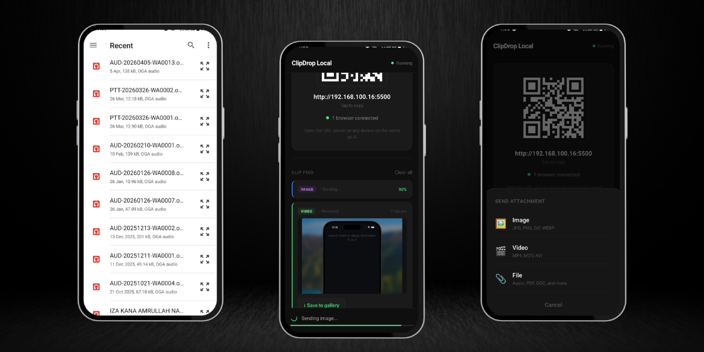
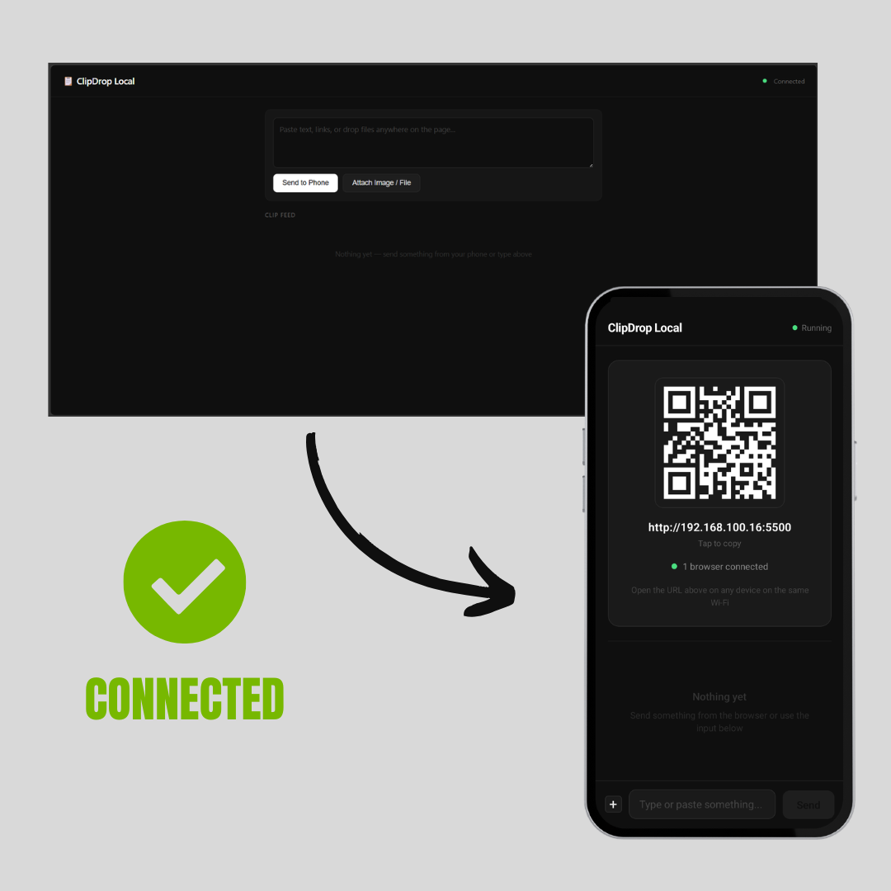
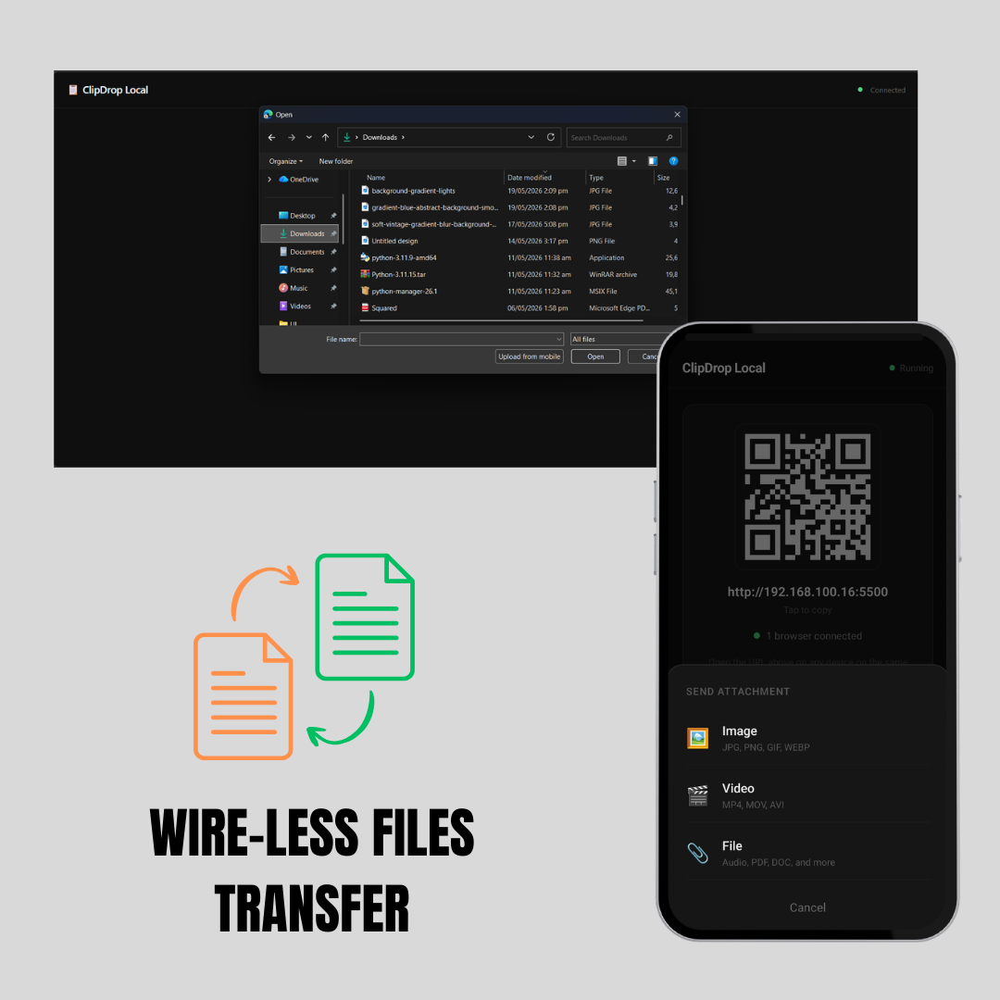
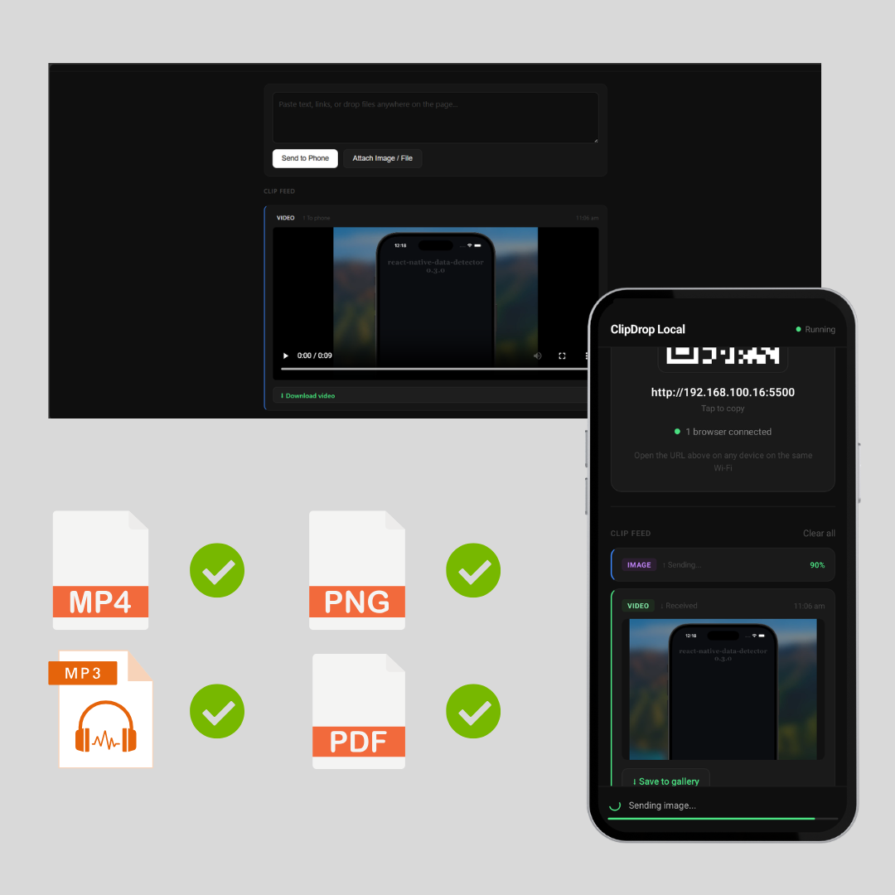

# Clipdrop Local

> Turn your phone into a local file-sharing server and transfer files instantly between mobile and desktop devices on the same network.

<p align="center">
  
</p>

**ClipDrop Local** is a React Native application that transforms your mobile device into a lightweight local server, enabling fast and secure file sharing between your phone and any web browser connected to the same network.

No cloud storage. No account creation.

Simply start the server, scan the generated QR code, and instantly send or receive files, images, videos, and text between devices.

---

## 📱 Screenshots

### 🔗 Connection Establishment

Start the local server and connect instantly from any device on the same Wi-Fi network using the generated URL or QR code.

<p align="center">
  
</p>

---

### ⚡ Wireless File Transfer

Transfer files seamlessly between your phone and browser without cables, cloud services, or account registration.

<p align="center">
  
</p>

---

### 📂 Multiple File Formats

Share images, videos, documents, audio files, text snippets, and more through a single intuitive interface.

<p align="center">
  
</p>

---

## ✨ Features

### 🔗 Instant Device Connection

- Generates a local server URL automatically
- QR code-based connection for quick access
- No manual IP typing required

### 📁 File Sharing

- Upload files from browser to mobile
- Send files from mobile to browser
- Supports documents, images, videos, audio files, and more

### 🖼️ Media Transfer

- Share images directly from gallery
- Transfer videos between devices
- Preview supported media files

### 📝 Text Sharing

- Send notes, snippets, and text instantly
- Clipboard integration for quick copying and pasting

### 🌐 Local Network Communication

- Works entirely over your Wi-Fi network
- No internet connection required after devices are connected
- Direct communication between devices

### 🔒 Privacy Focused

- Files never leave your local network
- No third-party servers involved
- No cloud storage dependency

### ⚡ Fast Transfers

- Utilizes local network speeds
- Real-time file exchange
- No upload/download bottlenecks

---

## 🏗️ How It Works

1. Launch ClipDrop Local on your mobile device.
2. Start the local server.
3. A local IP address and QR code are generated automatically.
4. Open the displayed URL or scan the QR code from another device connected to the same Wi-Fi network.
5. Instantly transfer files, images, videos, or text between devices.

```text
Phone (ClipDrop Local)
        │
        ▼
 Local TCP Server
        │
        ▼
 Browser Interface
        │
        ▼
 File Exchange